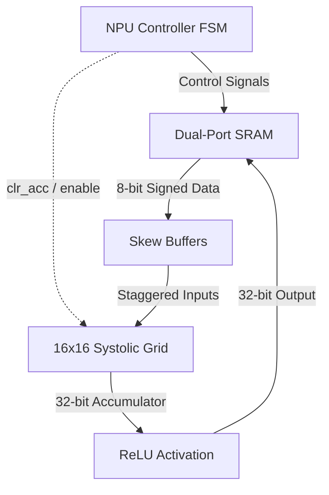

# LatticeMAC-Core

A parameterized 16×16 Systolic Array Neural Processing Unit (NPU) Core written in SystemVerilog. It is designed to accelerate matrix multiplication and basic neural network inference workloads.

## Overview

LatticeMAC-Core is a standalone hardware accelerator IP core that performs matrix operations using a 2D systolic array architecture.

The design includes:

* A parameterized systolic processing grid
* Dual-port SRAM scratchpad
* Row and column skew buffers for wavefront alignment
* 256 Processing Elements (PEs) in the default 16×16 configuration
* 8-bit signed inputs and 32-bit accumulators
* Hardware ReLU activation
* FSM-based control logic

The design was converted using `sv2v`, verified with Icarus Verilog (`iverilog`), and synthesized using Yosys.

## Hardware Architecture

The core processes matrix data through a pipelined, cycle-accurate dataflow:



### Dataflow

1. **LOAD**
   Input matrices are loaded into the dual-port SRAM.

2. **SKEW**
   The SRAM feeds row and column data into the skew buffers. The buffers add incremental delay cycles (`0, 1, 2, ..., N-1`) to create the diagonal wavefront required by the systolic array.

3. **COMPUTE**
   The systolic grid performs Multiply-Accumulate (MAC) operations. The default configuration uses a 16×16 grid with 256 Processing Elements.

4. **ACTIVATION**
   The accumulated results pass through the ReLU unit. Negative values are replaced with zero using sign-bit detection.

5. **WRITEBACK**
   The processed results are written back to SRAM or sent to the top-level outputs.

## Key Features

* **Grid Size:** 16×16 Processing Elements by default (256 PEs)
* **Parameterization:** The array size can be changed through the parameters in `npu_pkg.sv`
* **Input Data:** 8-bit signed integer (`int8`)
* **Accumulator:** 32-bit signed integer (`int32`)
* **Memory:** On-chip dual-port SRAM scratchpad
* **Control:** FSM-based controller
* **Activation:** Hardware ReLU
* **Architecture:** 2D systolic array
* **Verification:** Self-checking SystemVerilog testbench with a software reference model
* **FPGA Tested:** The NPU has also been tested on real FPGA hardware

## Project Structure

```text
.
├── Design/                     # SystemVerilog source files
│   ├── lattice_grid.sv         # Systolic PE array wrapper
│   ├── mac_pe.sv               # Individual Processing Element
│   ├── npu_controller.sv       # Main FSM controller
│   ├── npu_core.sv             # Top-level IP core
│   ├── npu_pkg.sv              # System packages and parameters
│   ├── relu_activation.sv      # ReLU activation unit
│   ├── skew_buffer.sv          # Wavefront delay buffer
│   └── sram_block.sv           # Dual-port local scratchpad
│
├── Verification/               # Testbenches and verification files
│   ├── tb_npu_core.sv          # Main system testbench
│   ├── tb_lattice_grid.sv      # Legacy 4×4 verification
│   ├── tb_mac_pe.sv             # Legacy PE unit test
│   └── tb_skew_buffer.sv       # Legacy buffer test
│
├── build_yosys.v               # Converted Verilog file for Yosys
└── README.md
```

## Verification

The top-level testbench uses a software reference model to calculate the expected matrix multiplication result.

The testbench:

1. Generates deterministic signed input matrices.
2. Loads the matrices into the NPU SRAM.
3. Starts the NPU computation.
4. Waits for the `done_out` signal.
5. Calculates the expected result in the testbench.
6. Applies the same ReLU operation to the expected result.
7. Compares all output elements with the hardware result.

The 16×16 test checks all 256 output values.

A successful simulation produces:

```text
SUCCESFULL: 16x16 NPU MATRIX PRODUCT AND RELU VERIFIED!
```

## Synthesis Results

The design was synthesized with Yosys using generic gate-level primitives.

| Metric                       |                Result |
| ---------------------------- | --------------------: |
| **Top Module**               |            `npu_core` |
| **Total Cells**              |              ~440,950 |
| **Total Flip-Flops (DFF)**   |                80,030 |
| **SRAM Register Storage**    |           65,536 DFFs |
| **Systolic Array (256 PEs)** |           12,288 DFFs |
| **Synthesis Status**         | 0 errors / clean pass |

These results are from generic Yosys synthesis and are not FPGA-specific resource utilization numbers.

## Getting Started

### Prerequisites

The following tools are required:

* **Icarus Verilog** (`iverilog`) for simulation
* **GTKWave** for waveform viewing
* **sv2v** for SystemVerilog to Verilog conversion
* **Yosys** for synthesis

### 1. Run Simulation

Convert the SystemVerilog sources and run the top-level testbench:

```bash
# Convert SystemVerilog to Verilog
sv2v Design/*.sv Verification/tb_npu_core.sv -w build_sim.v

# Compile with Icarus Verilog
iverilog -g2012 -o npu_sim build_sim.v

# Run simulation
vvp npu_sim

# View waveform
gtkwave npu_sim.vcd
```

### 2. Run Synthesis

Convert the design and run Yosys synthesis:

```bash
# Convert design sources to Verilog
sv2v Design/*.sv -w build_yosys.v

# Run Yosys synthesis
yosys -p "read_verilog build_yosys.v; synth -top npu_core; stat"
```

## License

Distributed under the MIT License.
